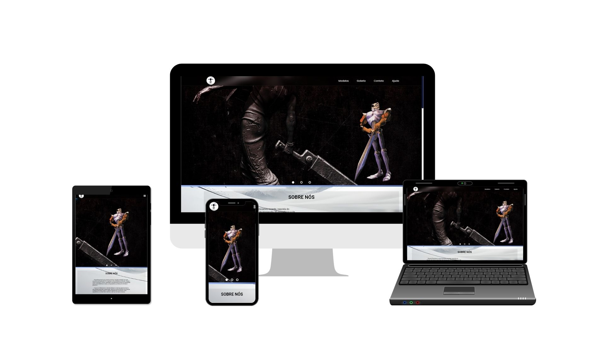

<h1 align="center">
    
    
[3D Printing](https://www.typescriptlang.org/)

</h1>
<h1 align="center">
    
</h1>

## 📕 Sobre
O objetivo deste projeto é desenvolver um site para uma empresa especializada no ramo de **3D Printing Action**. O site servirá como uma plataforma de divulgação do trabalho da empresa, fornecendo informações sobre os serviços oferecidos, exibindo amostras dos produtos e permitindo que os visitantes solicitem orçamentos de forma fácil e rápida.

## ⚒️ Ferramentas
-[HTML5](https://html.spec.whatwg.org/) 
-[CSS3](https://www.w3c.br/) 
-[JavaScript](https://www.typescriptlang.org/)

## 🗒️ Licença
Este projeto está sob a licença Mit. veja a licença do arquivo dor mais detalhes.
