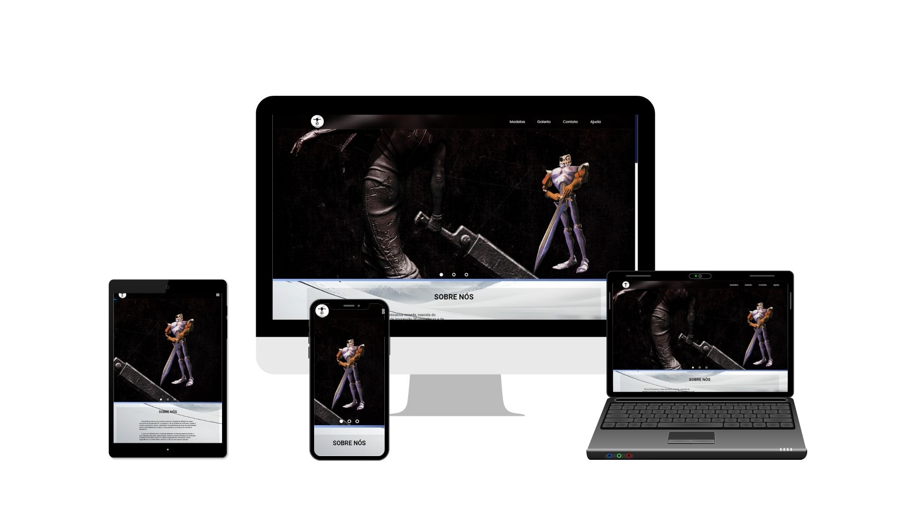

<h1 align="center">
    
    <p>3D Printing</p>
</h1>
<h1 align="center">
    
</h1>
## 📕 Sobre
O objetivo deste projeto é desenvolver um site para uma empresa especializada no ramo de **3D Printing Action**. O site servirá como uma plataforma de divulgação do trabalho da empresa, fornecendo informações sobre os serviços oferecidos, exibindo amostras dos produtos e permitindo que os visitantes solicitem orçamentos de forma fácil e rápida.

## ⚒️ Ferramentas

-[HTML5](https://html.spec.whatwg.org/)<br>
-[CSS3](https://www.w3c.br/)<br>
-[JavaScript](https://www.typescriptlang.org/)

## ♻️ Como Contribuir

```bash
    #clone the project
    $ git clone https://github.com/edlus2/3Dprinting
```

```bash
    # Enter directory
    $ cd 3Dprinting
```

```bash
    $ npm install
```
<p align="center">or</p>

```bash
    $ yarn
```

## 🗒️ Licença

este projeto está sob a licença Mit. veja a licença do arquivo dor mais detalhes.